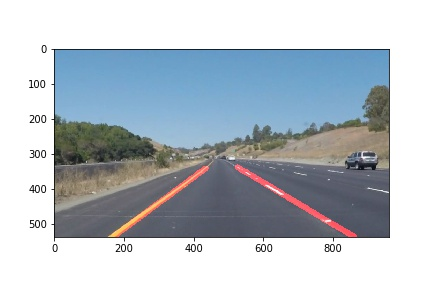

# **Finding Lane Lines on the Road**

## Project Deliverables
- [x] Ipython notebook with code
  - [2019-6-20_Lane_Line_Project_JLI.ipynb](./2019-6-20_Lane_Line_Project_JLI.ipynb)
- [x] A writeup report using markdown
  - [2019-06-20_Lane_Line_Doc_JLI.md](./2019-06-20_Lane_Line_Doc_JLI.md)
- [output images](./test_images_output)
- [output videos](./test_videos_output)

## Sample output
- **Image** : [Solid Yellow Curve](./test_images_output/output_solidYellowCurve.jpg)

- **Video** : [Solid White Right](./test_videos_output/output_solidWhiteRight.mp4)

## Reflections
### I. Project pipeline
My pipeline contains 6 steps
1. After creating lines `lines = cv2.HoughLinesP`
   - I find the slope of each line.
   - Retain the lines with the slope absolute value between 0.5 to 0.9.
     - this can remove the horizontal lines
2. Separate left and right data points by positive and negative slopes.
   - Array format [[x1,y1],[x2,y2],...,[xn,yn]]
3. Using `numpy.zip` function to reanage the array
   - New array format x = [x1,x2,...xn]; y = [y1,y2,...yn]
4. Find the trendline between __x__ and __y__.
   - Try two different order of `numpy.ployfit`
     - First order _np.polyfit(leftLineX,leftLineY,1)_ # __y = kx + b__ # result [k,b]
     - ~~Third order _np.polyfit(leftLineX,leftLineY,3)_ # __y = ax^3 + bx^2 + cx^1 + d__ # result [a,b,c,d]~~
     - 
     - 
     
> My intention of using the 3rd order line fitting is to capture the curve.
> But in reality, when there are discrete lines, my method cannot capture the curves or lines correctly.
> I need to spend more time on the algorithm in the future.
> Because of this, the final output was using the 1st order fitting.

5. Use the __k and b__ found in the 1st order fitting. I sweep the x pixel from 0 to `xMax` and find y.
   - When plotting the new line, the y values out of the picture frame are filtered out.
6. Create overlayed picture using `cv2.addWeighted`.  
   - [ ] Only the lane line was detected
   - [x] The continuous line uses 1st order fitting
   - [ ] The curve uses 3rd order fitting
   - **Return the overlaid picture using 1st order fitting**
   
### II. Shortcomings
1. Only detect straight lines, cannot find the curve
2. The shadow of the power grid might be captured
3. Not tested on the wet road
4. The detected lane line image is shaking.

### III. Possible improvement
1. To capture the curve, I can create segments on the image and using different methods in each segment.
   - Near-field using 1st order fitting, only consider straight lines.
   - Far-field using 3rd order fitting, which can capture the curves.
2. To reduce the shaking of the detected lane line, I can create a tolerance, if the slope __k__ after the 1sr order fitting is inside the tolerance then use the same slope for the current image.
